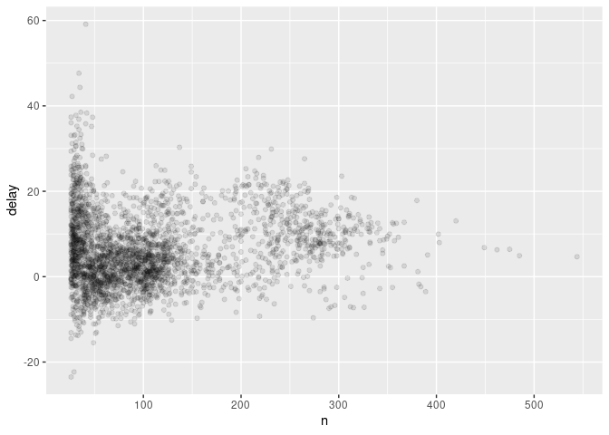

Data Transformation Assignment
================

``` r
library(nycflights13)
library(tidyverse)
```

    ## ── Attaching packages ──────────────────────────────────────────────────────────────────────────────────────────────────────── tidyverse 1.2.1 ──

    ## ✔ ggplot2 3.2.1     ✔ purrr   0.3.2
    ## ✔ tibble  2.1.3     ✔ dplyr   0.8.3
    ## ✔ tidyr   1.0.0     ✔ stringr 1.4.0
    ## ✔ readr   1.3.1     ✔ forcats 0.4.0

    ## ── Conflicts ─────────────────────────────────────────────────────────────────────────────────────────────────────────── tidyverse_conflicts() ──
    ## ✖ dplyr::filter() masks stats::filter()
    ## ✖ dplyr::lag()    masks stats::lag()

To access native functions that tidyverse overwrites use stats::filter()
and stats::lag() view flights opens the whole dataset in RStudio viewer
int - integers, dbl - double(realnumber), chr - character vectors, or
strings, dttm (date+time) lgl - logical (TRUE or FALSE) date - Should be
self evident

Variables are known by their columns Observations by rows Values are
contained in each row column cell

You pick observations by their values with filter() reorer rows by
arrange() pick variables by select() Create new variables with mutate()
summarize with summarise() group\_by() - changes scope

First argument is data frame, everything else describes what to do Save
results by assigning to variable (dec25 \<- filter(flights, month == 12,
day == 25)) Floating point numbers don’t work well with == , use near()
instead near(sqrt(2)^2, 2)

& and | or \! not xor(x,y)

NA is a missing value is.na(x) looks for missing values

\#5.2.4 Exercises

``` r
filter(flights, arr_delay > 2)
```

    ## # A tibble: 123,096 x 19
    ##     year month   day dep_time sched_dep_time dep_delay arr_time
    ##    <int> <int> <int>    <int>          <int>     <dbl>    <int>
    ##  1  2013     1     1      517            515         2      830
    ##  2  2013     1     1      533            529         4      850
    ##  3  2013     1     1      542            540         2      923
    ##  4  2013     1     1      554            558        -4      740
    ##  5  2013     1     1      555            600        -5      913
    ##  6  2013     1     1      558            600        -2      753
    ##  7  2013     1     1      558            600        -2      924
    ##  8  2013     1     1      559            600        -1      941
    ##  9  2013     1     1      600            600         0      837
    ## 10  2013     1     1      602            605        -3      821
    ## # … with 123,086 more rows, and 12 more variables: sched_arr_time <int>,
    ## #   arr_delay <dbl>, carrier <chr>, flight <int>, tailnum <chr>,
    ## #   origin <chr>, dest <chr>, air_time <dbl>, distance <dbl>, hour <dbl>,
    ## #   minute <dbl>, time_hour <dttm>

``` r
filter(flights, dest == 'IAH' | dest == 'HOU')
```

    ## # A tibble: 9,313 x 19
    ##     year month   day dep_time sched_dep_time dep_delay arr_time
    ##    <int> <int> <int>    <int>          <int>     <dbl>    <int>
    ##  1  2013     1     1      517            515         2      830
    ##  2  2013     1     1      533            529         4      850
    ##  3  2013     1     1      623            627        -4      933
    ##  4  2013     1     1      728            732        -4     1041
    ##  5  2013     1     1      739            739         0     1104
    ##  6  2013     1     1      908            908         0     1228
    ##  7  2013     1     1     1028           1026         2     1350
    ##  8  2013     1     1     1044           1045        -1     1352
    ##  9  2013     1     1     1114            900       134     1447
    ## 10  2013     1     1     1205           1200         5     1503
    ## # … with 9,303 more rows, and 12 more variables: sched_arr_time <int>,
    ## #   arr_delay <dbl>, carrier <chr>, flight <int>, tailnum <chr>,
    ## #   origin <chr>, dest <chr>, air_time <dbl>, distance <dbl>, hour <dbl>,
    ## #   minute <dbl>, time_hour <dttm>

``` r
filter(flights, carrier == 'AA' | carrier == 'UA' | carrier == 'DL' )
```

    ## # A tibble: 139,504 x 19
    ##     year month   day dep_time sched_dep_time dep_delay arr_time
    ##    <int> <int> <int>    <int>          <int>     <dbl>    <int>
    ##  1  2013     1     1      517            515         2      830
    ##  2  2013     1     1      533            529         4      850
    ##  3  2013     1     1      542            540         2      923
    ##  4  2013     1     1      554            600        -6      812
    ##  5  2013     1     1      554            558        -4      740
    ##  6  2013     1     1      558            600        -2      753
    ##  7  2013     1     1      558            600        -2      924
    ##  8  2013     1     1      558            600        -2      923
    ##  9  2013     1     1      559            600        -1      941
    ## 10  2013     1     1      559            600        -1      854
    ## # … with 139,494 more rows, and 12 more variables: sched_arr_time <int>,
    ## #   arr_delay <dbl>, carrier <chr>, flight <int>, tailnum <chr>,
    ## #   origin <chr>, dest <chr>, air_time <dbl>, distance <dbl>, hour <dbl>,
    ## #   minute <dbl>, time_hour <dttm>

``` r
filter(flights, (month == 7) | (month == 8) | (month == 9))
```

    ## # A tibble: 86,326 x 19
    ##     year month   day dep_time sched_dep_time dep_delay arr_time
    ##    <int> <int> <int>    <int>          <int>     <dbl>    <int>
    ##  1  2013     7     1        1           2029       212      236
    ##  2  2013     7     1        2           2359         3      344
    ##  3  2013     7     1       29           2245       104      151
    ##  4  2013     7     1       43           2130       193      322
    ##  5  2013     7     1       44           2150       174      300
    ##  6  2013     7     1       46           2051       235      304
    ##  7  2013     7     1       48           2001       287      308
    ##  8  2013     7     1       58           2155       183      335
    ##  9  2013     7     1      100           2146       194      327
    ## 10  2013     7     1      100           2245       135      337
    ## # … with 86,316 more rows, and 12 more variables: sched_arr_time <int>,
    ## #   arr_delay <dbl>, carrier <chr>, flight <int>, tailnum <chr>,
    ## #   origin <chr>, dest <chr>, air_time <dbl>, distance <dbl>, hour <dbl>,
    ## #   minute <dbl>, time_hour <dttm>

``` r
filter(flights, (arr_delay > 120) & (dep_delay <= 0))
```

    ## # A tibble: 29 x 19
    ##     year month   day dep_time sched_dep_time dep_delay arr_time
    ##    <int> <int> <int>    <int>          <int>     <dbl>    <int>
    ##  1  2013     1    27     1419           1420        -1     1754
    ##  2  2013    10     7     1350           1350         0     1736
    ##  3  2013    10     7     1357           1359        -2     1858
    ##  4  2013    10    16      657            700        -3     1258
    ##  5  2013    11     1      658            700        -2     1329
    ##  6  2013     3    18     1844           1847        -3       39
    ##  7  2013     4    17     1635           1640        -5     2049
    ##  8  2013     4    18      558            600        -2     1149
    ##  9  2013     4    18      655            700        -5     1213
    ## 10  2013     5    22     1827           1830        -3     2217
    ## # … with 19 more rows, and 12 more variables: sched_arr_time <int>,
    ## #   arr_delay <dbl>, carrier <chr>, flight <int>, tailnum <chr>,
    ## #   origin <chr>, dest <chr>, air_time <dbl>, distance <dbl>, hour <dbl>,
    ## #   minute <dbl>, time_hour <dttm>

``` r
filter(flights, (dep_delay >= 60) & (arr_delay <= 30))
```

    ## # A tibble: 239 x 19
    ##     year month   day dep_time sched_dep_time dep_delay arr_time
    ##    <int> <int> <int>    <int>          <int>     <dbl>    <int>
    ##  1  2013     1     3     1850           1745        65     2148
    ##  2  2013     1     3     1950           1845        65     2228
    ##  3  2013     1     3     2015           1915        60     2135
    ##  4  2013     1     6     1019            900        79     1558
    ##  5  2013     1     7     1543           1430        73     1758
    ##  6  2013     1    11     1020            920        60     1311
    ##  7  2013     1    12     1706           1600        66     1949
    ##  8  2013     1    12     1953           1845        68     2154
    ##  9  2013     1    19     1456           1355        61     1636
    ## 10  2013     1    21     1531           1430        61     1843
    ## # … with 229 more rows, and 12 more variables: sched_arr_time <int>,
    ## #   arr_delay <dbl>, carrier <chr>, flight <int>, tailnum <chr>,
    ## #   origin <chr>, dest <chr>, air_time <dbl>, distance <dbl>, hour <dbl>,
    ## #   minute <dbl>, time_hour <dttm>

``` r
filter(flights, (dep_time >= 2400) | (dep_time <= 600))
```

    ## # A tibble: 9,373 x 19
    ##     year month   day dep_time sched_dep_time dep_delay arr_time
    ##    <int> <int> <int>    <int>          <int>     <dbl>    <int>
    ##  1  2013     1     1      517            515         2      830
    ##  2  2013     1     1      533            529         4      850
    ##  3  2013     1     1      542            540         2      923
    ##  4  2013     1     1      544            545        -1     1004
    ##  5  2013     1     1      554            600        -6      812
    ##  6  2013     1     1      554            558        -4      740
    ##  7  2013     1     1      555            600        -5      913
    ##  8  2013     1     1      557            600        -3      709
    ##  9  2013     1     1      557            600        -3      838
    ## 10  2013     1     1      558            600        -2      753
    ## # … with 9,363 more rows, and 12 more variables: sched_arr_time <int>,
    ## #   arr_delay <dbl>, carrier <chr>, flight <int>, tailnum <chr>,
    ## #   origin <chr>, dest <chr>, air_time <dbl>, distance <dbl>, hour <dbl>,
    ## #   minute <dbl>, time_hour <dttm>

``` r
#This bit of code doesn't seem to work, it is selecting on 7
#Doesn't look like it works any way applied to month
#filter(flights, month %in% 7:9)
filter(flights, between(month, 7, 9))
```

    ## # A tibble: 86,326 x 19
    ##     year month   day dep_time sched_dep_time dep_delay arr_time
    ##    <int> <int> <int>    <int>          <int>     <dbl>    <int>
    ##  1  2013     7     1        1           2029       212      236
    ##  2  2013     7     1        2           2359         3      344
    ##  3  2013     7     1       29           2245       104      151
    ##  4  2013     7     1       43           2130       193      322
    ##  5  2013     7     1       44           2150       174      300
    ##  6  2013     7     1       46           2051       235      304
    ##  7  2013     7     1       48           2001       287      308
    ##  8  2013     7     1       58           2155       183      335
    ##  9  2013     7     1      100           2146       194      327
    ## 10  2013     7     1      100           2245       135      337
    ## # … with 86,316 more rows, and 12 more variables: sched_arr_time <int>,
    ## #   arr_delay <dbl>, carrier <chr>, flight <int>, tailnum <chr>,
    ## #   origin <chr>, dest <chr>, air_time <dbl>, distance <dbl>, hour <dbl>,
    ## #   minute <dbl>, time_hour <dttm>

``` r
#filter(flights, month %in% c(7, 8, 9))
filter(flights, between(hour, 0, 6))
```

    ## # A tibble: 27,905 x 19
    ##     year month   day dep_time sched_dep_time dep_delay arr_time
    ##    <int> <int> <int>    <int>          <int>     <dbl>    <int>
    ##  1  2013     1     1      517            515         2      830
    ##  2  2013     1     1      533            529         4      850
    ##  3  2013     1     1      542            540         2      923
    ##  4  2013     1     1      544            545        -1     1004
    ##  5  2013     1     1      554            600        -6      812
    ##  6  2013     1     1      554            558        -4      740
    ##  7  2013     1     1      555            600        -5      913
    ##  8  2013     1     1      557            600        -3      709
    ##  9  2013     1     1      557            600        -3      838
    ## 10  2013     1     1      558            600        -2      753
    ## # … with 27,895 more rows, and 12 more variables: sched_arr_time <int>,
    ## #   arr_delay <dbl>, carrier <chr>, flight <int>, tailnum <chr>,
    ## #   origin <chr>, dest <chr>, air_time <dbl>, distance <dbl>, hour <dbl>,
    ## #   minute <dbl>, time_hour <dttm>

``` r
filter(flights, is.na(dep_time))
```

    ## # A tibble: 8,255 x 19
    ##     year month   day dep_time sched_dep_time dep_delay arr_time
    ##    <int> <int> <int>    <int>          <int>     <dbl>    <int>
    ##  1  2013     1     1       NA           1630        NA       NA
    ##  2  2013     1     1       NA           1935        NA       NA
    ##  3  2013     1     1       NA           1500        NA       NA
    ##  4  2013     1     1       NA            600        NA       NA
    ##  5  2013     1     2       NA           1540        NA       NA
    ##  6  2013     1     2       NA           1620        NA       NA
    ##  7  2013     1     2       NA           1355        NA       NA
    ##  8  2013     1     2       NA           1420        NA       NA
    ##  9  2013     1     2       NA           1321        NA       NA
    ## 10  2013     1     2       NA           1545        NA       NA
    ## # … with 8,245 more rows, and 12 more variables: sched_arr_time <int>,
    ## #   arr_delay <dbl>, carrier <chr>, flight <int>, tailnum <chr>,
    ## #   origin <chr>, dest <chr>, air_time <dbl>, distance <dbl>, hour <dbl>,
    ## #   minute <dbl>, time_hour <dttm>

Na ^ 0 equals 1. or true is always true. False and NA are not missing
for a similar reason, the boolean expression returns a T or F value, no
matter what NA’s value is. It appears from google the answer is way more
complicated once exceptions are included. Why is na^0 = 1 when na \* 0
is NA…

MORE EXERCISES

``` r
#arrange(flights, desc(is.na(flights?)))
arrange(flights, desc(dep_delay))
```

    ## # A tibble: 336,776 x 19
    ##     year month   day dep_time sched_dep_time dep_delay arr_time
    ##    <int> <int> <int>    <int>          <int>     <dbl>    <int>
    ##  1  2013     1     9      641            900      1301     1242
    ##  2  2013     6    15     1432           1935      1137     1607
    ##  3  2013     1    10     1121           1635      1126     1239
    ##  4  2013     9    20     1139           1845      1014     1457
    ##  5  2013     7    22      845           1600      1005     1044
    ##  6  2013     4    10     1100           1900       960     1342
    ##  7  2013     3    17     2321            810       911      135
    ##  8  2013     6    27      959           1900       899     1236
    ##  9  2013     7    22     2257            759       898      121
    ## 10  2013    12     5      756           1700       896     1058
    ## # … with 336,766 more rows, and 12 more variables: sched_arr_time <int>,
    ## #   arr_delay <dbl>, carrier <chr>, flight <int>, tailnum <chr>,
    ## #   origin <chr>, dest <chr>, air_time <dbl>, distance <dbl>, hour <dbl>,
    ## #   minute <dbl>, time_hour <dttm>

``` r
arrange(flights, dep_delay)
```

    ## # A tibble: 336,776 x 19
    ##     year month   day dep_time sched_dep_time dep_delay arr_time
    ##    <int> <int> <int>    <int>          <int>     <dbl>    <int>
    ##  1  2013    12     7     2040           2123       -43       40
    ##  2  2013     2     3     2022           2055       -33     2240
    ##  3  2013    11    10     1408           1440       -32     1549
    ##  4  2013     1    11     1900           1930       -30     2233
    ##  5  2013     1    29     1703           1730       -27     1947
    ##  6  2013     8     9      729            755       -26     1002
    ##  7  2013    10    23     1907           1932       -25     2143
    ##  8  2013     3    30     2030           2055       -25     2213
    ##  9  2013     3     2     1431           1455       -24     1601
    ## 10  2013     5     5      934            958       -24     1225
    ## # … with 336,766 more rows, and 12 more variables: sched_arr_time <int>,
    ## #   arr_delay <dbl>, carrier <chr>, flight <int>, tailnum <chr>,
    ## #   origin <chr>, dest <chr>, air_time <dbl>, distance <dbl>, hour <dbl>,
    ## #   minute <dbl>, time_hour <dttm>

``` r
arrange(flights, air_time)
```

    ## # A tibble: 336,776 x 19
    ##     year month   day dep_time sched_dep_time dep_delay arr_time
    ##    <int> <int> <int>    <int>          <int>     <dbl>    <int>
    ##  1  2013     1    16     1355           1315        40     1442
    ##  2  2013     4    13      537            527        10      622
    ##  3  2013    12     6      922            851        31     1021
    ##  4  2013     2     3     2153           2129        24     2247
    ##  5  2013     2     5     1303           1315       -12     1342
    ##  6  2013     2    12     2123           2130        -7     2211
    ##  7  2013     3     2     1450           1500       -10     1547
    ##  8  2013     3     8     2026           1935        51     2131
    ##  9  2013     3    18     1456           1329        87     1533
    ## 10  2013     3    19     2226           2145        41     2305
    ## # … with 336,766 more rows, and 12 more variables: sched_arr_time <int>,
    ## #   arr_delay <dbl>, carrier <chr>, flight <int>, tailnum <chr>,
    ## #   origin <chr>, dest <chr>, air_time <dbl>, distance <dbl>, hour <dbl>,
    ## #   minute <dbl>, time_hour <dttm>

``` r
arrange(flights, desc(air_time))
```

    ## # A tibble: 336,776 x 19
    ##     year month   day dep_time sched_dep_time dep_delay arr_time
    ##    <int> <int> <int>    <int>          <int>     <dbl>    <int>
    ##  1  2013     3    17     1337           1335         2     1937
    ##  2  2013     2     6      853            900        -7     1542
    ##  3  2013     3    15     1001           1000         1     1551
    ##  4  2013     3    17     1006           1000         6     1607
    ##  5  2013     3    16     1001           1000         1     1544
    ##  6  2013     2     5      900            900         0     1555
    ##  7  2013    11    12      936            930         6     1630
    ##  8  2013     3    14      958           1000        -2     1542
    ##  9  2013    11    20     1006           1000         6     1639
    ## 10  2013     3    15     1342           1335         7     1924
    ## # … with 336,766 more rows, and 12 more variables: sched_arr_time <int>,
    ## #   arr_delay <dbl>, carrier <chr>, flight <int>, tailnum <chr>,
    ## #   origin <chr>, dest <chr>, air_time <dbl>, distance <dbl>, hour <dbl>,
    ## #   minute <dbl>, time_hour <dttm>

Select all columns from year to day select(flights, year:day) select all
columns except those from year to day select(flights, -(year:day))

Helper functions for select include starts\_with(“abc”)
ends\_with(“xyz”) contains(“ijk”) matches(“(.)\\1”) num\_range(“x”,
1:3) Matches x1, x2, x3 everything() selects all the variables
remaining, useful to move a few things around

Select can remane variables, but drops all unselected ones rename()
keeps all other variables and renames one

EXERCISES

``` r
select(flights, dep_time, dep_delay, arr_time, arr_delay)
```

    ## # A tibble: 336,776 x 4
    ##    dep_time dep_delay arr_time arr_delay
    ##       <int>     <dbl>    <int>     <dbl>
    ##  1      517         2      830        11
    ##  2      533         4      850        20
    ##  3      542         2      923        33
    ##  4      544        -1     1004       -18
    ##  5      554        -6      812       -25
    ##  6      554        -4      740        12
    ##  7      555        -5      913        19
    ##  8      557        -3      709       -14
    ##  9      557        -3      838        -8
    ## 10      558        -2      753         8
    ## # … with 336,766 more rows

``` r
select(flights, dep_time, dep_time)
```

    ## # A tibble: 336,776 x 1
    ##    dep_time
    ##       <int>
    ##  1      517
    ##  2      533
    ##  3      542
    ##  4      544
    ##  5      554
    ##  6      554
    ##  7      555
    ##  8      557
    ##  9      557
    ## 10      558
    ## # … with 336,766 more rows

``` r
vars <- c("year", "month", "day", "dep_delay", "arr_delay")
#select(flights, vars)
#select(flights, one_of(vars))
select(flights, contains("TIME"))
```

    ## # A tibble: 336,776 x 6
    ##    dep_time sched_dep_time arr_time sched_arr_time air_time
    ##       <int>          <int>    <int>          <int>    <dbl>
    ##  1      517            515      830            819      227
    ##  2      533            529      850            830      227
    ##  3      542            540      923            850      160
    ##  4      544            545     1004           1022      183
    ##  5      554            600      812            837      116
    ##  6      554            558      740            728      150
    ##  7      555            600      913            854      158
    ##  8      557            600      709            723       53
    ##  9      557            600      838            846      140
    ## 10      558            600      753            745      138
    ## # … with 336,766 more rows, and 1 more variable: time_hour <dttm>

``` r
select(flights, contains("TIME", ignore.case = F))
```

    ## # A tibble: 336,776 x 0

It seems to drop any additional selections One\_of() returns an error
“Error: All arguments must be character vectors, not list” It is
suprising…why is it not case sensitive?

mutate() makes new columns that are functions of other existing
columns.

``` r
flights_sml <- select(flights, year:day, ends_with("delay"), distance, air_time)
mutate(flights_sml, gain = dep_delay - arr_delay, speed = distance /air_time * 60)
```

    ## # A tibble: 336,776 x 9
    ##     year month   day dep_delay arr_delay distance air_time  gain speed
    ##    <int> <int> <int>     <dbl>     <dbl>    <dbl>    <dbl> <dbl> <dbl>
    ##  1  2013     1     1         2        11     1400      227    -9  370.
    ##  2  2013     1     1         4        20     1416      227   -16  374.
    ##  3  2013     1     1         2        33     1089      160   -31  408.
    ##  4  2013     1     1        -1       -18     1576      183    17  517.
    ##  5  2013     1     1        -6       -25      762      116    19  394.
    ##  6  2013     1     1        -4        12      719      150   -16  288.
    ##  7  2013     1     1        -5        19     1065      158   -24  404.
    ##  8  2013     1     1        -3       -14      229       53    11  259.
    ##  9  2013     1     1        -3        -8      944      140     5  405.
    ## 10  2013     1     1        -2         8      733      138   -10  319.
    ## # … with 336,766 more rows

transmute() only keeps the new
values

``` r
transmute(flights, gain = dep_delay - arr_delay, hours = air_time / 60, gain_per_hour = gain /hour)
```

    ## # A tibble: 336,776 x 3
    ##     gain hours gain_per_hour
    ##    <dbl> <dbl>         <dbl>
    ##  1    -9 3.78         -1.8  
    ##  2   -16 3.78         -3.2  
    ##  3   -31 2.67         -6.2  
    ##  4    17 3.05          3.4  
    ##  5    19 1.93          3.17 
    ##  6   -16 2.5          -3.2  
    ##  7   -24 2.63         -4    
    ##  8    11 0.883         1.83 
    ##  9     5 2.33          0.833
    ## 10   -10 2.3          -1.67 
    ## # … with 336,766 more rows

cumulative and rolling aggregates cumsun() cumprod() cummin() cunmax()
cummean() \#These might be useful for networking class stats ^
min\_rank() row\_number() dense\_rank() percent\_rank() cume\_dist()

# 5.5.2

``` r
transmute(flights, hour * 60 + minute)
```

    ## # A tibble: 336,776 x 1
    ##    `hour * 60 + minute`
    ##                   <dbl>
    ##  1                  315
    ##  2                  329
    ##  3                  340
    ##  4                  345
    ##  5                  360
    ##  6                  358
    ##  7                  360
    ##  8                  360
    ##  9                  360
    ## 10                  360
    ## # … with 336,766 more rows

``` r
transmute(flights, arr_time-dep_time)
```

    ## # A tibble: 336,776 x 1
    ##    `arr_time - dep_time`
    ##                    <int>
    ##  1                   313
    ##  2                   317
    ##  3                   381
    ##  4                   460
    ##  5                   258
    ##  6                   186
    ##  7                   358
    ##  8                   152
    ##  9                   281
    ## 10                   195
    ## # … with 336,766 more rows

``` r
flights %>% 
  mutate(dep_time = (dep_time %/% 100) * 60 + (dep_time %% 100), sched_dep_time = (sched_dep_time %/% 100) * 60 + (sched_dep_time %% 100),
         arr_time = (arr_time %/% 100) * 60 + (arr_time %% 100), sched_arr_time = (sched_arr_time %/% 100) * 60 + (sched_arr_time %% 100)) %>%
  transmute((arr_time - dep_time) %% (60*24) - air_time)
```

    ## # A tibble: 336,776 x 1
    ##    `(arr_time - dep_time)%%(60 * 24) - air_time`
    ##                                            <dbl>
    ##  1                                           -34
    ##  2                                           -30
    ##  3                                            61
    ##  4                                            77
    ##  5                                            22
    ##  6                                           -44
    ##  7                                            40
    ##  8                                            19
    ##  9                                            21
    ## 10                                           -23
    ## # … with 336,766 more rows

``` r
flights %>% top_n(10, dep_delay)
```

    ## # A tibble: 10 x 19
    ##     year month   day dep_time sched_dep_time dep_delay arr_time
    ##    <int> <int> <int>    <int>          <int>     <dbl>    <int>
    ##  1  2013     1     9      641            900      1301     1242
    ##  2  2013     1    10     1121           1635      1126     1239
    ##  3  2013    12     5      756           1700       896     1058
    ##  4  2013     3    17     2321            810       911      135
    ##  5  2013     4    10     1100           1900       960     1342
    ##  6  2013     6    15     1432           1935      1137     1607
    ##  7  2013     6    27      959           1900       899     1236
    ##  8  2013     7    22      845           1600      1005     1044
    ##  9  2013     7    22     2257            759       898      121
    ## 10  2013     9    20     1139           1845      1014     1457
    ## # … with 12 more variables: sched_arr_time <int>, arr_delay <dbl>,
    ## #   carrier <chr>, flight <int>, tailnum <chr>, origin <chr>, dest <chr>,
    ## #   air_time <dbl>, distance <dbl>, hour <dbl>, minute <dbl>,
    ## #   time_hour <dttm>

USING SUMMARIZE

``` r
summarise(flights, delay = mean(dep_delay, na.rm = TRUE))
```

    ## # A tibble: 1 x 1
    ##   delay
    ##   <dbl>
    ## 1  12.6

``` r
by_day <- group_by(flights, year, month, day)
summarise(by_day, delay = mean(dep_delay, na.rm = TRUE))
```

    ## # A tibble: 365 x 4
    ## # Groups:   year, month [12]
    ##     year month   day delay
    ##    <int> <int> <int> <dbl>
    ##  1  2013     1     1 11.5 
    ##  2  2013     1     2 13.9 
    ##  3  2013     1     3 11.0 
    ##  4  2013     1     4  8.95
    ##  5  2013     1     5  5.73
    ##  6  2013     1     6  7.15
    ##  7  2013     1     7  5.42
    ##  8  2013     1     8  2.55
    ##  9  2013     1     9  2.28
    ## 10  2013     1    10  2.84
    ## # … with 355 more rows

``` r
delays <- flights %>% 
  group_by(dest) %>% 
  summarise(
    count = n(),
    dist = mean(distance, na.rm = TRUE),
    delay = mean(arr_delay, na.rm = TRUE)
  ) %>% 
  filter(count > 20, dest != "HNL")

ggplot(data = delays, mapping = aes(x = dist, y = delay)) +
  geom_point(aes(size = count), alpha = 1/3) +
  geom_smooth(se = FALSE)
```

    ## `geom_smooth()` using method = 'loess' and formula 'y ~ x'

<!-- -->

Piping function, like the linux shell x %\>% f(y)

na.rm removes missing values

``` r
not_cancelled <- flights %>% 
  filter(!is.na(dep_delay), !is.na(arr_delay))

not_cancelled %>% 
  group_by(year, month, day) %>% 
  summarise(mean = mean(dep_delay))
```

    ## # A tibble: 365 x 4
    ## # Groups:   year, month [12]
    ##     year month   day  mean
    ##    <int> <int> <int> <dbl>
    ##  1  2013     1     1 11.4 
    ##  2  2013     1     2 13.7 
    ##  3  2013     1     3 10.9 
    ##  4  2013     1     4  8.97
    ##  5  2013     1     5  5.73
    ##  6  2013     1     6  7.15
    ##  7  2013     1     7  5.42
    ##  8  2013     1     8  2.56
    ##  9  2013     1     9  2.30
    ## 10  2013     1    10  2.84
    ## # … with 355 more rows

``` r
delays <- not_cancelled %>% 
  group_by(tailnum) %>% 
  summarise(
    delay = mean(arr_delay)
  )

ggplot(data = delays, mapping = aes(x = delay)) + 
  geom_freqpoly(binwidth = 10)
```

<!-- -->

``` r
delays <- not_cancelled %>% 
  group_by(tailnum) %>% 
  summarise(
    delay = mean(arr_delay, na.rm = TRUE),
    n = n()
  )


delays %>% 
  filter(n > 25) %>% 
  ggplot(mapping = aes(x = n, y = delay)) + 
    geom_point(alpha = 1/10)
```

<!-- -->
